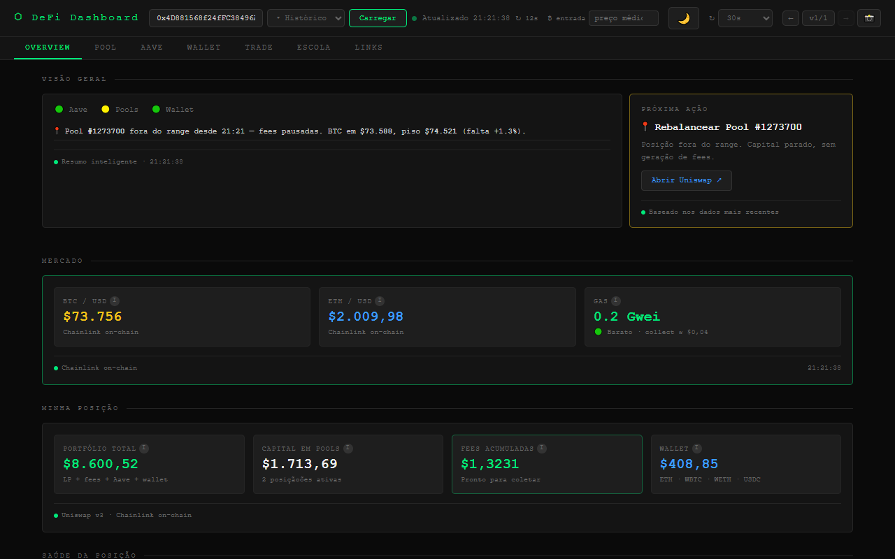
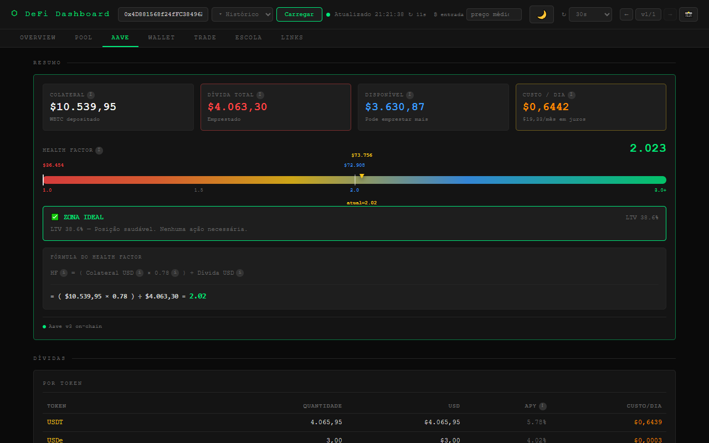

# ⬡ DeFi Dashboard

Dashboard pessoal para monitoramento de operações DeFi em tempo real — sem backend, sem chaves de API. Lê dados directamente da blockchain Ethereum via Ethers.js + RPCs públicos.



---

## Funcionalidades

**Overview** — semáforo Aave/Pools/Wallet, resumo inteligente, próxima acção recomendada, preços BTC/ETH/Gas via Chainlink on-chain.

**Pool** — posições Uniswap v3 com capital, fees acumuladas (via `feeGrowthInside`), range bar e alerta OUT OF RANGE.

**Aave** — Health Factor com gauge de 3 camadas (preços BTC / barra gradiente / escala HF), simulador por pool (slider por token com toggle colateral/dívida), ranking de cenários.



**Wallet** — saldos ERC-20, composição do portfólio.

**Trade** — gráfico OHLC BTC (30d/7d/3d/1d) com EMA9/EMA21, sinal COMPRAR/VENDER/NEUTRA baseado em RSI + MACD + Bollinger Bands.

**Histórico** — snapshots automáticos a cada 15min, navegação `← v8/10 →`, dropdown com HF e BTC price por versão.

---

## Stack

| Camada | Tecnologia |
|---|---|
| UI | HTML5 + CSS3 + vanilla ES6 (sem framework) |
| Blockchain | Ethers.js v6 · 4 RPCs com fallback automático |
| Preços | Chainlink on-chain → Binance → CoinGecko |
| Gráficos | Lightweight Charts v4 · TradingView widget |
| Persistência | `localStorage` (histórico, tema, preferências) |

---

## Início rápido

```bash
npm install
npm test        # valida fórmulas Uniswap v3
npm run dev     # http://localhost:3000
```

Cole o endereço da carteira no header e clique **Carregar**.

---

## Arquitectura

```
index.html          ← UI, estilos, lógica de render (~2700 linhas)
js/
  config.js         ← ABIs, endereços, constantes
  provider.js       ← RPC com fallback (publicnode → ankr → cloudflare → llamarpc)
  prices.js         ← Chainlink + Binance + CoinGecko
  uniswap.js        ← Uniswap v3: sqrtX96toNorm, calcAmounts, calcFees (BigInt)
  aave.js           ← Aave v3: colateral, dívida, HF, sugestões de pagamento
  analysis.js       ← EMA, RSI, MACD, Bollinger, sinal de trade
test/
  test-uniswap.js   ← testes das fórmulas de matemática concentrada
docs/               ← screenshots
```

**Refresh por camada:**
- HIGH 15s — preços + gas
- MID 30s — posições Uniswap + wallet
- LOW 60s — Aave + análise técnica + auto-snapshot

---

## Configuração

Edite `js/config.js` para alterar `WALLET_ADDRESS`, `AAVE_DEBT_APYS` ou adicionar tokens.

---

## Próximas melhorias

- [ ] Suporte a Arbitrum / Base / Optimism
- [ ] Alertas por Telegram quando HF < 1.8
- [ ] Histórico de patrimônio em gráfico
- [ ] Integração com Revert Finance API
